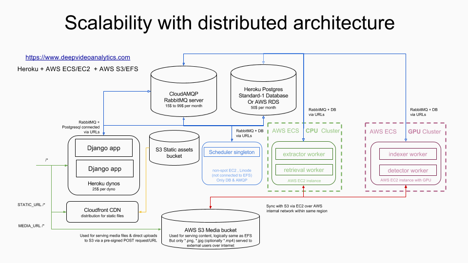

# Distributed deployment on AWS & Heroku

This directory contains scripts and files required for a distributed deployment.



### Checklist for cloud deployment
 
(Incomplete, will add a cloudformation script in future)

- Setup Heroku app & Heroku postgres database
- Add Cloud RabbitMQ extension to heroku app
- Create two S3 buckets one for media & one for static assets
- Set correct permissions for both buckets using fab task
- Create cloudfront distribution in front of static assets
- Generate heroku.env which contains SECRET (for Django), RabbitMQ, media bucket name and Postgres URL
- Store heroku.env a private separate config S3 bucket
- Create AWS IAM roles, Security Groups
- Create EFS using web console, !Ensure that VPC Security Group inbound rules are correctly set to allow EC2 <--> EFS!

E.g. following inbound rules
```
Type        | Protocol Port Range   | Source
ALL Traffic | ALL ALL               | sg-(Security group of VPC)
NFS (2049)  | TCP (6) 2049          | sg-(Security group of EC2)
```
- Add information to config_example.py and rename it to config.py
- Perform heroku bootstrap task and deploy to heroku
- Launch AWS fleet


### Heroku App information

* Addons:       
    - cloudamqp:tiger  
    - heroku-postgresql:standard-0  
* Auto Cert Mgmt: true  
* Dynos:          web: 1  
* Git URL:        https://git.heroku.com/deepvideoanalytics.git  
* Owner:          akshayubhat@gmail.com  
* Region:         us  
* Repo Size:      262 MB  
* Slug Size:      112 MB  
* Stack:          cedar-14  
* Web URL:        https://deepvideoanalytics.herokuapp.com/
  
### Heroku App environment variables

- ALLOWED_HOSTS:               deepvideoanalytics.herokuapp.com,www.deepvideoanalytics.com # List of domain names to serve app on
- AWS_ACCESS_KEY_ID:           <AWS key ideally for IAM user scoped to media bucket>
- AWS_SECRET_ACCESS_KEY:       <AWS seceret ideally for IAM user scoped to media bucket>
- CLOUDAMQP_URL:               <amqp auth url> # auto set by heroku database add-on
- DATABASE_URL:                <postgres auth url> # auto set by cloudamqp add-on
- DISABLE_COLLECTSTATIC:       1 # Disable static asset creation since they are served through cloudfront
- DISABLE_DEBUG:               1
- DEPLOY_ON_HEROKU:            1
- MEDIA_BUCKET:                <s3-media-bucket> # manually create
- MEDIA_URL:                   http://<s3-media-bucket>.s3-website-us-east-1.amazonaws.com/
- SECRET_KEY:                  <Django seceret> # make sure this stays secret
- STATIC_URL:                  https://<>.cloudfront.net/ # cloudfront distribution url that serves static assets